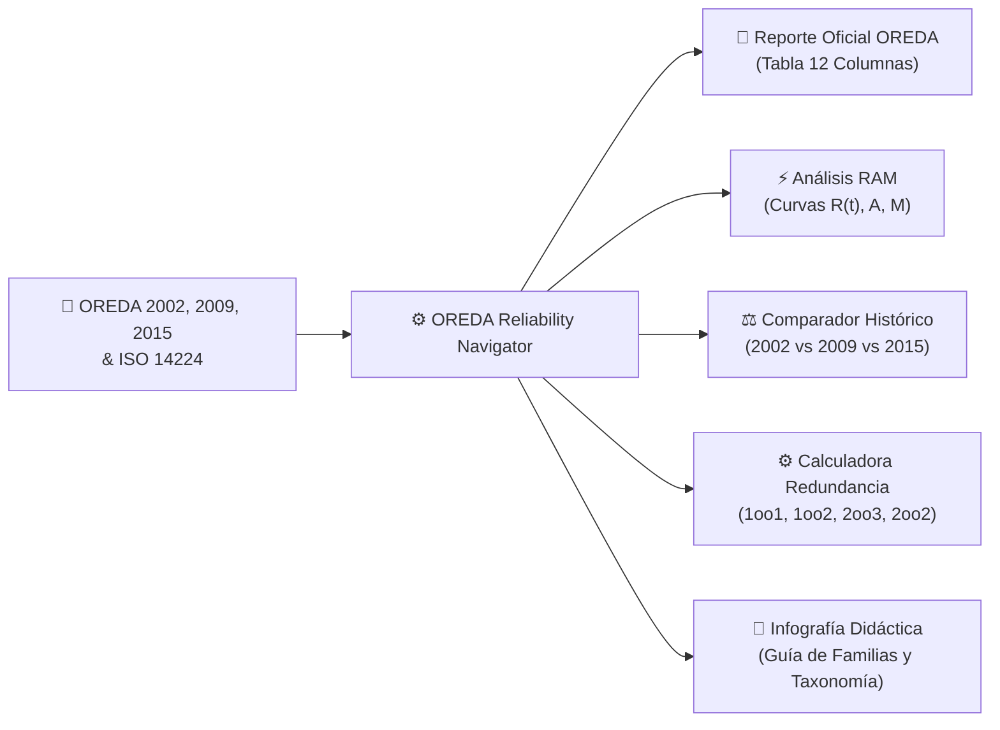
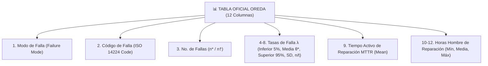

# MANUAL DE USUARIO
## OREDA Reliability Navigator & Didactic Suite
### Plataforma de Consulta, Análisis RAM y Modelado de Confiabilidad Costa Afuera
**Norma de Referencia:** ISO 14224 | **Fuentes de Datos:** OREDA 2002 (4ª Ed.), 2009 (5ª Ed.) y 2015 (6ª Ed.)  
**Desarrollado para:** Grupo Reliarisk Software & Consulting  
**Versión del Documento:** 4.0.0 (Edición Oficial)

---

## 1. INTRODUCCIÓN Y PROPÓSITO DEL SISTEMA

### 1.1 ¿Qué es OREDA Reliability Navigator?
**OREDA Reliability Navigator** es una plataforma tecnológica de ingeniería de confiabilidad desarrollada para permitir a ingenieros, analistas RAM (*Reliability, Availability, and Maintainability*), especialistas de integridad y planificadores de mantenimiento consultar, analizar y modelar de forma ágil y rigurosa la información estadística de falla y reparación de activos costa afuera (*offshore*) y terrestres (*onshore*).

La plataforma incorpora las 3 ediciones históricas maestras del consorcio OREDA (**2002, 2009 y 2015**) estructuradas de acuerdo con la norma internacional **ISO 14224**, integrando más de **460 perfiles de equipos**, **5 familias principales** y más de **5,170 registros de modos de falla** categorizados por severidad y base temporal.



### 1.2 Perfil de Usuarios Autorizados
Este sistema ha sido diseñado para personal técnico con responsabilidades en:
- **Ingeniería de Confiabilidad y Mantenibilidad (RAM):** Modelado de disponibilidad de plantas y cálculo de pérdidas de producción.
- **Ingeniería de Seguridad Funcional (SIS / SIL):** Estimación de tasas de falla bajo demanda ($PFD_{avg}$) y frecuencias de disparo espurio ($PFS$).
- **Planificación de Mantenimiento y Gestión de Activos:** Estimación de tiempos de reparación ($MTTR$) y horas hombre ($HH$).
- **Diseño de Proyectos (CAPEX / FEED):** Selección de arquitecturas redundantes (1oo1, 1oo2, 2oo3) para equipos críticos.

---

## 2. ARQUITECTURA DE LA APLICACIÓN

La suite está estructurada en dos entornos web interconectados y 100% autónomos:

| Módulo / Archivo | Nombre | Descripción y Función |
| :--- | :--- | :--- |
| **`index.html`** | **Navegador Principal OREDA** | Entorno operativo con selector de ediciones, árbol taxonómico ISO 14224, tabla oficial de reportes, análisis RAM estocástico, comparador histórico y calculadora de redundancia. |
| **`infografia.html`** | **Infografía Didáctica OREDA** | Módulo educativo e interactivo que explica la historia, las 5 grandes familias de equipos, la taxonomía de 9 niveles, los 4 niveles de severidad y las fórmulas matemáticas. |
| **`oreda_data.js` / `.json`** | **Base de Datos Maestra** | Almacén estructurado con 463 perfiles de equipo, clasificados en las 3 ediciones con registros de falla duales (* y †). |
| **`iniciar_aplicacion.bat`** | **Lanzador Local** | Script de inicio automático de servidor local HTTP en el puerto 8080. |

---

## 3. GUÍA DE USO PASO A PASO: NAVEGADOR PRINCIPAL (`index.html`)

### 3.1 Paso 1: Selección de Edición OREDA
En la barra superior de la aplicación, el usuario puede seleccionar la edición de referencia con un solo clic:
- **2002 (4ª Edición):** Muestra representativa de activos de primera y segunda generación del Mar del Norte.
- **2009 (5ª Edición - Referencia):** Edición canónica dividida en 2 volúmenes (Topside y Subsea) con desglose exhaustivo de equipos eléctricos, recipientes por volumen y válvulas por tamaño.
- **2015 (6ª Edición):** Edición moderna que incorpora tecnologías en aguas profundas y sistemas con mantenimiento predictivo.

> **Botón Especial:**  
> Al hacer clic en **`✦ Reporte Imagen Referencia`**, el sistema carga de forma instantánea el perfil exacto de recipientes (*Process Vessel*) que coincide con la imagen de muestra de OREDA 2009.

---

### 3.2 Paso 2: Navegación Taxonómica Jerárquica (ISO 14224)

El usuario dispone de dos métodos complementarios para ubicar cualquier equipo:

#### Método A: Panel Lateral de Jerarquía (Sidebar)
1. Ingrese una palabra clave en la barra de búsqueda omnidireccional (ej. `Compresor`, `Generador`, `ESDV`, `Separador`, `SCM`).
2. Expanda la familia correspondiente (ej. `⚡ Equipo Eléctrico`).
3. Despliegue la clase de equipo (ej. `Generadores Eléctricos`).
4. Seleccione el subtipo y criterio específico (ej. `Generador Diesel | Emergencia | (-1000) kVA`).

#### Método B: Barra de Filtros en Cascada (Niveles 5 a 8)
Ubicada sobre el área principal de trabajo, permite filtrar paso a paso:
1. **1. Familia:** Selecciona la familia ISO 14224 (Maquinaria, Eléctrico, Mecánico, Control y Seguridad, Submarino).
2. **2. Clase de Equipo:** Filtra las clases pertenecientes a la familia activa.
3. **3. Subtipo / Equipo:** Define el tipo específico de maquinaria o recipiente.
4. **4. Criterio / Factor:** Selecciona el rango de potencia, volumen, accionador o servicio de proceso.

---

### 3.3 Paso 3: Módulo 1 - Reporte Oficial OREDA (Tabla de 12 Columnas)

Esta vista replica fielmente el diseño editorial del manual OREDA original:



#### Filtros Superiores de la Tabla:
1. **Base Temporal:**
   - **Ambas (* y †):** Muestra el par de registros para cada modo de falla.
   - **Calendario (*):** Muestra únicamente tasas calculadas sobre horas calendario en servicio.
   - **Operacional (†):** Muestra únicamente tasas calculadas sobre horas efectivas de marcha.
2. **Filtro Multi-Nivel de Severidad:**
   - Permite filtrar la tabla para mostrar uno, varios o todos los niveles de severidad:
     - **🔴 1. Críticos (Critical):** Pérdida total inmediata de la función principal.
     - **🟡 2. Degradados (Degraded):** Pérdida parcial de capacidad o rendimiento.
     - **🔵 3. Incipientes (Incipient):** Condición o defecto incipiente sin paro inmediato.
     - **⚪ 4. Desconocidos (Unknown):** Severidad no especificada en el registro original.
     - **Todos:** Muestra todos los niveles con sus cabeceras agrupadas y el resumen global (*All modes*).

#### Acciones de Exportación:
- **`📊 Exportar CSV`:** Descarga un archivo CSV estructurado listo para software RAM como Maros, TARO, Isograph o BlockSim.
- **`📋 Copiar Tabla (Excel)`:** Copia la tabla en formato TSV directamente al portapapeles para pegarla en Microsoft Excel con un solo clic (`Ctrl + V`).
- **`🖨️ Imprimir Reporte`:** Genera una versión limpia para impresión o guardado como PDF profesional.

---

### 3.4 Paso 4: Módulo 2 - Análisis RAM & Confiabilidad

Al hacer clic en la pestaña **`⚡ Análisis RAM & Confiabilidad`**, el sistema calcula y grafica automáticamente:

1. **Tarjetas Bento de KPIs Clave:**
   - **Tasa de Falla Global ($\lambda$):** Expresada en fallas por $10^6$ h y fallas por año.
   - **MTBF (Tiempo Medio Entre Fallas):** Horas y años continuos de operación libre de fallas.
   - **MTTR Activo:** Horas promedio requeridas para restablecer el equipo.
   - **Horas Hombre (HH):** Esfuerzo laboral promedio por evento de mantenimiento.
   - **Disponibilidad Inherente ($A_i$):** Porcentaje de disponibilidad teórica $MTBF / (MTBF + MTTR)$.
   - **Indisponibilidad Anual:** Horas promedio de parada no planificada al año.

2. **Gráficos Estocásticos Renderizados en SVG de Alta Precisión:**
   - **Gráfico 1: Curvas de Confiabilidad $R(t)$ y No Confiabilidad $F(t)$:** Evolución temporal de la probabilidad de supervivencia durante 8,760 horas (1 año).
   - **Gráfico 2: Diagrama de Pareto de Modos de Falla:** Identifica el 20% de modos de falla responsables del 80% de las paradas.
   - **Gráfico 3: Función de Mantenibilidad $M(t)$:** Curva acumulada de probabilidad de completar la reparación antes de un tiempo $t$.
   - **Gráfico 4: Intervalos de Incertidumbre Gamma (90% Confianza):** Visualización de los límites 5%, Media y 95% para los principales modos de falla.

---

### 3.5 Paso 5: Módulo 3 - Comparativa de Ediciones (2002 vs 2009 vs 2015)

Permite contrastar cómo ha evolucionado la confiabilidad de la clase de equipo a lo largo del tiempo:
- Compara población de equipos ($N$), instalaciones vigiladas, horas operacionales acumuladas y tasa de falla promedio.
- Gráfico de barras históricas que ilustra la tendencia de mejora o incremento de confiabilidad entre las ediciones.

---

### 3.6 Paso 6: Módulo 4 - Calculadora de Redundancia y Disponibilidad

Herramienta para evaluar el impacto de distintas filosofías de diseño:
- **1oo1 (Simple):** Un solo equipo en servicio continuo.
- **1oo2 (Reserva Activa / Paralelo):** 1 equipo operativo y 1 en reserva disponible ($Q_{1oo2} = Q^2$).
- **2oo3 (Votación Triple Modular / TMR):** Arquitectura típica de sistemas instrumentados de seguridad ($Q_{2oo3} = 3Q^2 - 2Q^3$).
- **2oo2 (Serie):** Ambos equipos requeridos simultáneamente para operar.
- **Simulación Económica:** Permite ingresar horas operativas anuales y costo por hora de parada ($/h) para cuantificar el costo anual por lucro cesante.

---

## 4. GUÍA DE USO: INFOGRAFÍA DIDÁCTICA (`infografia.html`)

La Infografía Didáctica es un recurso educativo diseñado para capacitación y presentaciones ejecutivas:
1. **Línea de Tiempo Interactiva:** Explica la evolución de OREDA desde 2002 hasta 2015.
2. **Explorador Visual de las 5 Familias:** Fichas técnicas completas para Maquinaria, Eléctrico, Mecánico, Control y Submarino.
3. **Árbol de 9 Niveles ISO 14224:** Visualización conceptual desde el nivel de Industria (Nivel 1) hasta Partes y Piezas (Nivel 9).
4. **Matriz de Severidad:** Tarjetas didácticas para los 4 niveles de falla (Crítico, Degradado, Incipiente y Desconocido).
5. **Formulario de Fórmulas Matemáticas:** Explicación matemática de $\lambda$, $MTBF$, $MTTR$, Disponibilidad e Intervalos Gamma.
6. **Buscador en Vivo:** Tabla interactiva que permite buscar cualquier equipo y conocer su código taxonómico y cobertura.

---

## 5. REQUISITOS TÉCNICOS Y DESPLIEGUE

### 5.1 Requisitos del Sistema
- **Sistema Operativo:** Windows 10/11, macOS, Linux.
- **Navegador Web Recomendado:** Google Chrome, Microsoft Edge, Mozilla Firefox o Safari (versiones modernas con soporte para ES6 y SVG).
- **Python (Opcional para servidor local):** Python 3.8 o superior.

### 5.2 Instrucciones de Inicio Rápido
1. Haga doble clic en el archivo **`iniciar_aplicacion.bat`**.
2. El lanzador iniciará automáticamente el servidor HTTP local y abrirá su navegador en:
   ```text
   http://localhost:8080/index.html
   ```
3. Para abrir la infografía didáctica, haga clic en el botón **`📘 Guía Didáctica e Infografía`** en la cabecera superior, o ingrese directamente a:
   ```text
   http://localhost:8080/infografia.html
   ```

---

## 6. GLOSARIO DE TÉRMINOS Y SÍMBOLOS

| Símbolo / Término | Significado Técnico OREDA / ISO 14224 |
| :---: | :--- |
| **$n$** | Número de fallas observadas durante el período de vigilancia. |
| **$t$** | Tiempo acumulado en servicio (en millones de horas, $10^6$ h). |
| **$\lambda$ (Lambda)** | Tasa de falla estimada ($\lambda = n / t$). |
| **$*$ (Asterisco)** | Tasa de falla calculada sobre **Tiempo Calendario** (horas transcurridas desde instalación). |
| **$\dagger$ (Daga)** | Tasa de falla calculada sobre **Tiempo Operacional** (horas efectivas de funcionamiento en marcha). |
| **$\lambda_{5\%}$ (Límite Inferior)** | Percentil 5% de la distribución de tasas (límite inferior del intervalo de confianza al 90%). |
| **$\theta^*$ (Media)** | Estimador puntual medio de la tasa de falla en OREDA. |
| **$\lambda_{95\%}$ (Límite Superior)** | Percentil 95% de la distribución de tasas (límite superior del intervalo de confianza al 90%). |
| **$SD$** | Desviación estándar de la tasa de falla estimada. |
| **$MTTR$** | Tiempo Medio Para Reparar (*Mean Time To Restoration* / Tiempo de reparación activa en horas). |
| **$HH$** | Horas Hombre promedio dedicadas al mantenimiento correctivo por falla. |
| **$Ai$** | Disponibilidad Inherente del equipo ($Ai = MTBF / (MTBF + MTTR)$). |
| **SCM** | *Subsea Control Module* (Módulo de control submarino electrohidráulico). |
| **ESDV** | *Emergency Shutdown Valve* (Válvula de aislamiento de seguridad de emergencia). |
| **BDV** | *Blowdown Valve* (Válvula de despresurización de proceso). |
| **TMR** | *Triple Modular Redundancy* (Arquitectura 2oo3 con tolerancia a fallas). |

---
*Documento propiedad de Grupo Reliarisk Software & Consulting. Elaborado en estricta conformidad con ISO 14224 y los manuales OREDA 2002, 2009 y 2015.*
